# Visual Gallery

Generated by `tools/build_metadata.py`.

<table>
  <tr>
    <td align="center"> <code>blizzard.png</code></td>
    <td align="center"> <code>blizzardn.png</code></td>
    <td align="center"> <code>blowingsnow.png</code></td>
    <td align="center"> <code>blowingsnown.png</code></td>
    <td align="center"> <code>buona.png</code></td>
  </tr>
  <tr>
    <td align="center"> <code>cattiva.png</code></td>
    <td align="center"> <code>clear-day.png</code></td>
    <td align="center"> <code>clear-night.png</code></td>
    <td align="center"> <code>clearn.png</code></td>
    <td align="center"> <code>cloudy.png</code></td>
  </tr>
  <tr>
    <td align="center"> <code>cloudy2.png</code></td>
    <td align="center"> <code>cloudyn.png</code></td>
    <td align="center"> <code>cloudyw.png</code></td>
    <td align="center"> <code>cloudywn.png</code></td>
    <td align="center">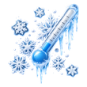 <code>cold-day.png</code></td>
  </tr>
  <tr>
    <td align="center"> <code>discreta.png</code></td>
    <td align="center"> <code>drizzle.png</code></td>
    <td align="center"> <code>drizzlef.png</code></td>
    <td align="center"> <code>drizzlen.png</code></td>
    <td align="center"> <code>dust.png</code></td>
  </tr>
  <tr>
    <td align="center"> <code>dustn.png</code></td>
    <td align="center"> <code>fair.png</code></td>
    <td align="center"> <code>fairn.png</code></td>
    <td align="center"> <code>flurries.png</code></td>
    <td align="center"> <code>flurriesn.png</code></td>
  </tr>
  <tr>
    <td align="center"> <code>flurriesw.png</code></td>
    <td align="center"> <code>flurrieswn.png</code></td>
    <td align="center">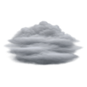 <code>fog.png</code></td>
    <td align="center"> <code>fogn.png</code></td>
    <td align="center"> <code>freezingrain.png</code></td>
  </tr>
  <tr>
    <td align="center"> <code>freezingrainn.png</code></td>
    <td align="center"> <code>hail.png</code></td>
    <td align="center"> <code>hazy.png</code></td>
    <td align="center"> <code>hazyn.png</code></td>
    <td align="center"> <code>hot.png</code></td>
  </tr>
  <tr>
    <td align="center"> <code>icon.png</code></td>
    <td align="center"> <code>indefinited.png</code></td>
    <td align="center"> <code>mcloudy.png</code></td>
    <td align="center"> <code>mcloudyn.png</code></td>
    <td align="center"> <code>mcloudyr.png</code></td>
  </tr>
  <tr>
    <td align="center"> <code>mcloudyrn.png</code></td>
    <td align="center"> <code>mcloudyrw.png</code></td>
    <td align="center"> <code>mcloudyrwn.png</code></td>
    <td align="center"> <code>mcloudys.png</code></td>
    <td align="center"> <code>mcloudysf.png</code></td>
  </tr>
  <tr>
    <td align="center"> <code>mcloudysfn.png</code></td>
    <td align="center"> <code>mcloudysfw.png</code></td>
    <td align="center"> <code>mcloudysfwn.png</code></td>
    <td align="center"> <code>mcloudysfwx.png</code></td>
    <td align="center"> <code>mcloudysn.png</code></td>
  </tr>
  <tr>
    <td align="center"> <code>mcloudysw.png</code></td>
    <td align="center"> <code>mcloudyswn.png</code></td>
    <td align="center"> <code>mcloudyt.png</code></td>
    <td align="center"> <code>mcloudytn.png</code></td>
    <td align="center"> <code>mcloudytw.png</code></td>
  </tr>
  <tr>
    <td align="center"> <code>mcloudytwn.png</code></td>
    <td align="center"> <code>mcloudyw.png</code></td>
    <td align="center"> <code>mcloudywn.png</code></td>
    <td align="center"> <code>moderata.png</code></td>
    <td align="center"> <code>molto_cattiva.png</code></td>
  </tr>
  <tr>
    <td align="center"> <code>mostly-clear-day.png</code></td>
    <td align="center"> <code>mostly-clear-night.png</code></td>
    <td align="center"> <code>mostly-cloudy-day.png</code></td>
    <td align="center"> <code>mostly-cloudy-night.png</code></td>
    <td align="center"> <code>nero.png</code></td>
  </tr>
  <tr>
    <td align="center"> <code>partly-cloudy-day.png</code></td>
    <td align="center"> <code>partly-cloudy-night.png</code></td>
    <td align="center"> <code>pcloudy.png</code></td>
    <td align="center"> <code>pcloudyn.png</code></td>
    <td align="center"> <code>pcloudyr.png</code></td>
  </tr>
  <tr>
    <td align="center"> <code>pcloudyrn.png</code></td>
    <td align="center"> <code>pcloudyrw.png</code></td>
    <td align="center"> <code>pcloudyrwn.png</code></td>
    <td align="center"> <code>pcloudys.png</code></td>
    <td align="center"> <code>pcloudysf.png</code></td>
  </tr>
  <tr>
    <td align="center"> <code>pcloudysfn.png</code></td>
    <td align="center"> <code>pcloudysfw.png</code></td>
    <td align="center"> <code>pcloudysfwn.png</code></td>
    <td align="center"> <code>pcloudysn.png</code></td>
    <td align="center"> <code>pcloudysw.png</code></td>
  </tr>
  <tr>
    <td align="center"> <code>pcloudyswn.png</code></td>
    <td align="center"> <code>pcloudyt.png</code></td>
    <td align="center"> <code>pcloudytn.png</code></td>
    <td align="center"> <code>pcloudytw.png</code></td>
    <td align="center"> <code>pcloudytwn.png</code></td>
  </tr>
  <tr>
    <td align="center"> <code>pcloudyw.png</code></td>
    <td align="center"> <code>pcloudywn.png</code></td>
    <td align="center"> <code>pessima.png</code></td>
    <td align="center"> <code>rain.png</code></td>
    <td align="center"> <code>rain_scale.png</code></td>
  </tr>
  <tr>
    <td align="center"> <code>rain_scale2.png</code></td>
    <td align="center"> <code>rain_scale_sun.png</code></td>
    <td align="center"> <code>rainandsnow.png</code></td>
    <td align="center"> <code>rainandsnown.png</code></td>
    <td align="center"> <code>rainn.png</code></td>
  </tr>
  <tr>
    <td align="center"> <code>raintosnow.png</code></td>
    <td align="center"> <code>raintosnown.png</code></td>
    <td align="center"> <code>rainw.png</code></td>
    <td align="center"> <code>showers.png</code></td>
    <td align="center"> <code>showersn.png</code></td>
  </tr>
  <tr>
    <td align="center"> <code>showersw.png</code></td>
    <td align="center"> <code>showerswn.png</code></td>
    <td align="center"> <code>sleet.png</code></td>
    <td align="center"> <code>sleetn.png</code></td>
    <td align="center"> <code>sleetsnow.png</code></td>
  </tr>
  <tr>
    <td align="center">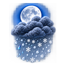 <code>sleetsnown.png</code></td>
    <td align="center">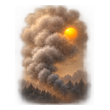 <code>smoke.png</code></td>
    <td align="center"> <code>smoken.png</code></td>
    <td align="center"> <code>snow.png</code></td>
    <td align="center"> <code>snowflake-icon-15px.png</code></td>
  </tr>
  <tr>
    <td align="center"> <code>snown.png</code></td>
    <td align="center"> <code>snowshowers.png</code></td>
    <td align="center"> <code>snowshowersn.png</code></td>
    <td align="center"> <code>snowshowersw.png</code></td>
    <td align="center"> <code>snowshowerswn.png</code></td>
  </tr>
  <tr>
    <td align="center">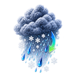 <code>snowtorain.png</code></td>
    <td align="center">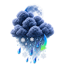 <code>snowtorainn.png</code></td>
    <td align="center"> <code>snoww.png</code></td>
    <td align="center"> <code>station.png</code></td>
    <td align="center">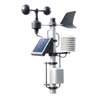 <code>station144.png</code></td>
  </tr>
  <tr>
    <td align="center">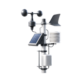 <code>station168.png</code></td>
    <td align="center">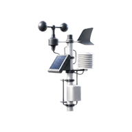 <code>station192.png</code></td>
    <td align="center"> <code>station48.png</code></td>
    <td align="center"> <code>station72.png</code></td>
    <td align="center">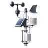 <code>station96.png</code></td>
  </tr>
  <tr>
    <td align="center"> <code>sunny.png</code></td>
    <td align="center"> <code>sunnyn.png</code></td>
    <td align="center"> <code>sunnyw.png</code></td>
    <td align="center"> <code>sunnywn.png</code></td>
    <td align="center"> <code>sunrise.png</code></td>
  </tr>
  <tr>
    <td align="center"> <code>sunset.png</code></td>
    <td align="center"> <code>Test.png</code></td>
    <td align="center"> <code>thunderstorm.png</code></td>
    <td align="center">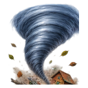 <code>tornado.png</code></td>
    <td align="center"> <code>tstorm.png</code></td>
  </tr>
  <tr>
    <td align="center"> <code>tstormn.png</code></td>
    <td align="center">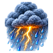 <code>tstorms.png</code></td>
    <td align="center"> <code>tstormsn.png</code></td>
    <td align="center"> <code>tstormsw.png</code></td>
    <td align="center"> <code>tstormswn.png</code></td>
  </tr>
  <tr>
    <td align="center"> <code>undefined.png</code></td>
    <td align="center"> <code>unknow.png</code></td>
    <td align="center"> <code>unknown.png</code></td>
    <td align="center"> <code>wind.png</code></td>
    <td align="center"> <code>windy.png</code></td>
  </tr>
  <tr>
    <td align="center"> <code>wintrymix.png</code></td>
    <td align="center"> <code>wintrymixn.png</code></td>
    <td></td>
    <td></td>
    <td></td>
  </tr>
</table>
